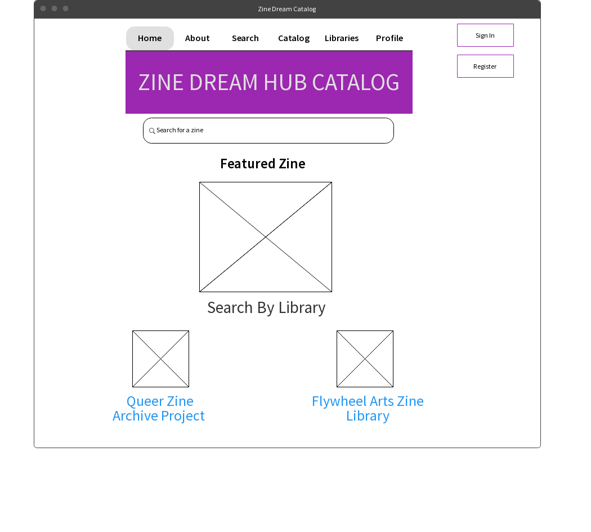
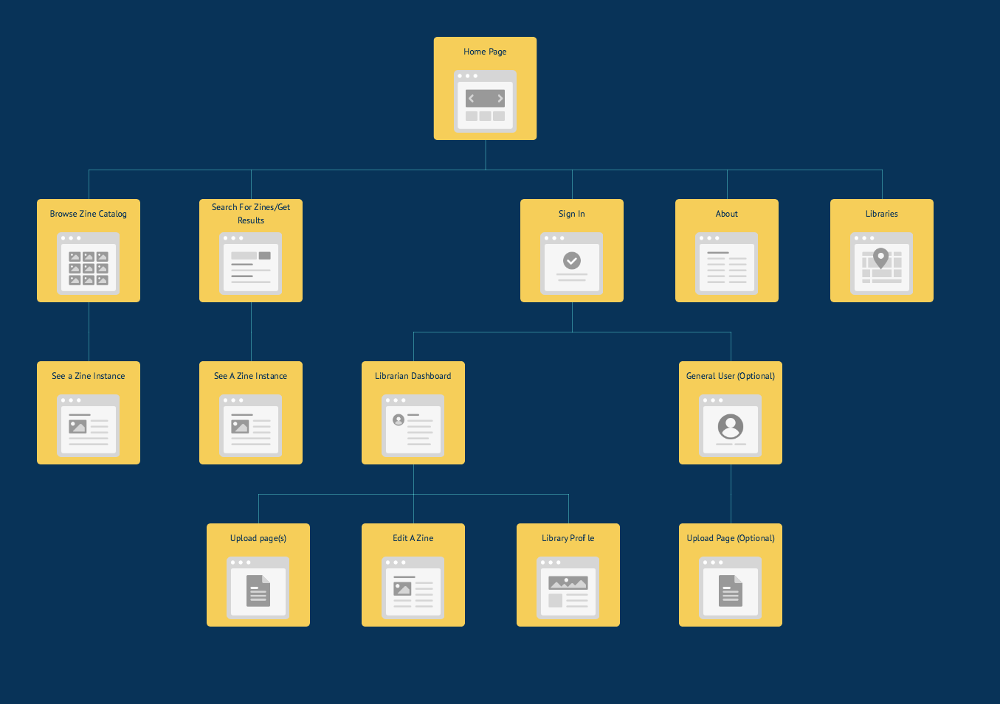

# Product Plan: Zine Catalog    
### _Problem Statement_  
Zines (DIY-magazines) are wonderful learning resources as well as physical snapshots of community, history, and culture. Many institutions (academic, nonprofit, or private) have begun to collect and catalog zines in order to archive them and subsequently make them available to the public. Though there are many groups collecting and cataloging zines, a consistent standard for cataloging among all zine libraries has yet to be developed and implemented. Nor is there a shared tool that meets the needs of every library’s collection and resources. In addition, zines themselves can be notoriously hard to catalog, as many zines don’t have full names for authors, publishing dates, or even titles.

A Flexible Zine Catalog can help zine librarians find, share, and update a union catalog together. This project would be a study on how to build a database that could join different, existing zine collections (to start, the Queer Zine Archive Project and the Flywheel Zine Library) and to discover a way to bring these resources together without conforming to one set standard or schema. Zine librarians (authenticated users) will be able to add their collections to the database. The web app would also allow users to search through the database.

_Personal Learning Goals_     
* Learn about a different type of database (mongoDB) and how to build an app around it
* Build an app using (mostly) new technologies for the front and backend
* Improve my understanding of Javascript and its many frameworks

<!-- * normalize data imports from different collections -->

### _Market Research_
<!-- _Outline the key insights from your research, including:_
  - your application’s competition
  - what alternatives are already out there (competing apps and/or non-app solutions)
    - alternatives: ZineWiki, LibraryThing
    - Questions: Why don't people use ZineWiki more often?
    - How can this zine catalog hub fit needs of non-librarians?
  - research from users on why these alternatives do not effectively address the problem.
    - current problems: usability, legacy catalogs/collections
  - differentiation: what makes your idea/product different
    - provide a solution for legacy collections to be integrated with other catalogs
    - make it open source for anyone to utilize
    - make it interactive and dynamic -->

Zine librarians are exposed to a wealth of cataloging systems and online sites. Some popular places where zine librarians might start a collection include [LibraryThing](https://www.librarything.com/) or [ZineWiki](http://zinewiki.com/). Software that helps librarians catalog collections also include [CollectiveAccess](http://collectiveaccess.org/) and [Omeka](https://omeka.org/).

With so many options, there isn't a website/catalog devoted strictly zines and zine libraries. Besides ZineWiki, sites like LibraryThing exist primarily to organize book collections. The fields associated with books--such as ISBNs and author/editor fields--can't always map to zine metadata (ex. most zines don't have ISBNs, and the lines are blurry when it comes to authors/editors/creators). Some of these options also require zine librarians to cohere to Library of Congress standards, or provide metadata for fields that don't always apply to zines. And though ZineWiki is a great place to stop for information, it's not suited for exporting or importing into a database.

Therefore, zine librarians are searching for a database alternative that's devoted to zines and their uniqueness. In fact, the idea of a [Zine Union Catalog](http://zinelibraries.info/zine-union-catalog/) has been in the making for years. In a [2015 survey conducted on zine librarians](https://github.com/MiloQZAP/xZINECOREx/blob/master/shared-zine-lib-cat-analytics-Librarians.pdf), 83% of librarians surveyed responded in favor of a zine union catalog that would help cut-down on cataloging time while increasing discoverability of zines.

The Zine Catalog Hub will make zine cataloging more accessible to all types of zine collectors or librarians, especially for those who do not have a professional librarian background or work within an academic institution. In addition, it aims to unify collections without forcing one use-case or  re-cataloging to a specific standard. It's pretty much what a Zine Union Catalog might look like at it's most basic level, and without some particular things found in [xZINECOREx](http://zinelibraries.info/zine-union-catalog/) metadata standards (such as a Union ID). To start, the Zine Catalog Hub will look at two collections (the Queer Zine Archive Project and the Flywheel Zine Library), and create a database and app for viewing their information in one place. It will also allow for special users (zine librarians) to add their collections and make them browsable online.

### _User Personas_  
There are two audiences for this application: zine librarians and zine enthusiasts/general visitors.
The main feature of the website is to allow zine librarians to provide information about their zine library or collection without conforming to an existing schema. A librarian's main user feature will be the ability to upload an existing collection in its current structure, without the need to rename fields or confirm to a specific convention.

The Zine Catalog website itself will unify all collections in its own way by mapping out fields to xZINECOREx metadata standards, saving a librarian from reconfiguring their catalogs.
<!-- In addition, librarians might want to pull information about a particular zine that already exists in the database, saving them time from re-cataloging a zine. They can improve on existing descriptions or tags as well. Creating an API to the website can help librarians connect their collections on their own sites or in other ways. -->

The website will also be for zine enthusiasts, such as researchers. Researchers can use the website to find information about particular zines and where they are physically stored.
<!-- Contributors could be zine makers who would like to add their personal zines to the collection without it being attached to a library. These users would upload their information about a zine through a default form, following xZINECOREx conventions. -->

### _Trello Board_   

[Capstone Trello Board](https://trello.com/b/fpNjBLBY/capstone-plan)

This Trello board includes tasks for finishing the features below:

**MVP Feature Set**  

* A  general user/visitor can see the collections of two zine libraries in one website
* A  general user/visitor can view zine metadata and the zine’s cover photo (when applicable)
* A general user/visitor can search by library, or by various fields (location, date of publication, etc.)

**Additional Features**  
* An authorized librarian (given permissions/on an Access Control List (ACL) can add zines/zine collections to the database
* A librarian can add a CSV of their collection, which will be parsed for the website
* A librarian can edit/update fields for existing zines
* A librarian can find a zine and "add" it to their library (establish a relationship between that zine and the librarian's collection, even if it was originally cataloged in a different collection)

* A visitor can create sign in/create their own profile and add their own resources (potentially just one zine in a form, or upload a spreadsheet of a collection)

### _Technology Selections_    

- Front-End    
  - Ember.js
  - QUnit (Ember testing)
- Back-End  
  - MongoDB
  - Node.js
  - Express.js
  - Jasmine (back-end testing)  
- Infrastructure  
  - Heroku for hosting

<!-- - ItemsAPI(maybe?)
  - Research further: Elasticsearch for pulling out zines across collections (will creating a search field yield results from different collections? can we integrate results from apis like CollectiveAccess or LibraryThing?) -->
### _Wireframes and Diagrams_  

###### _Home Page_

##### Mock Website Flow  

(Last updated: 01/01/2017, with mapping of additional features)

An in-depth view of the website flow (with notes) can be seen on [MockFlow](https://sitemap.mockflow.com/view/zinedream).

##### Schema Comparison of QZAP and Flywheel's Collections
https://docs.google.com/document/d/1wX1Wf0VMzbVe2tlUzv07D5obIHTdPJ-k63T02nE6Dc8/edit?usp=sharing

